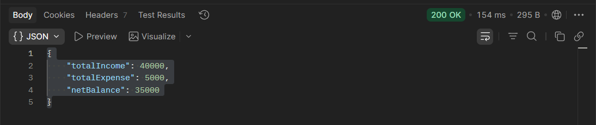
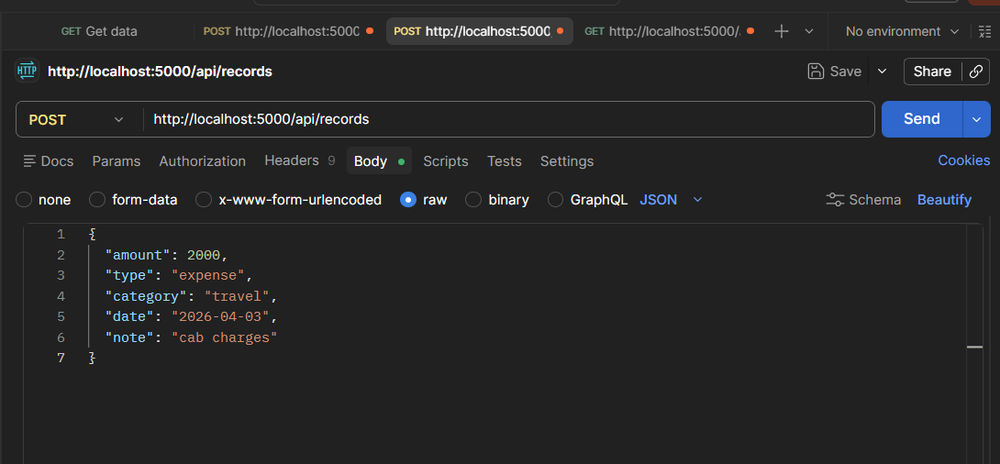

Finance Data Processing Backend

A backend system for managing financial records with JWT authentication, role-based access control, and real-time dashboard analytics.

🛠 Tech Stack
Node.js
Express.js
MongoDB Atlas
JWT Authentication
🔐 Features
User Registration & Login
Role-Based Access Control (Viewer, Analyst, Admin)
Financial Records CRUD (Income/Expense)
Dashboard Summary API (Income, Expense, Balance)
👥 Roles
Viewer → View dashboard only
Analyst → View records & insights
Admin → Full access (Create, Update, Delete)
📊 Dashboard Output
{
  "totalIncome": 40000,
  "totalExpense": 5000,
  "netBalance": 35000
}
⚙️ Setup
npm install

Create .env:

PORT=5000
MONGO_URI=your_mongodb_connection_string
JWT_SECRET=your_secret_key

Run server:

npm start
📡 API Endpoints
Auth
POST /api/auth/register
POST /api/auth/login
Records
POST /api/records
GET /api/records
Dashboard
GET /api/dashboard/summary
🔑 Authorization
Authorization: <JWT_TOKEN>
🧠 Summary
Tested using Postman
## 📸 Screenshots

### Dashboard Output

### Record Creation API

Implemented a finance backend with secure authentication, role-based access, and dynamic aggregation of financial data using MongoDB.
